# Architecture — IQ Relay

> Agents League Hackathon 2026
> Microsoft IQ: Foundry IQ + Work IQ
> Core principle: AI structures, humans decide, the organization remembers

---

## Architecture Diagram

```mermaid
flowchart LR
    classDef user      fill:#E8F4FD,stroke:#2E86AB,stroke-width:2px,color:#1a1a1a,rx:0,ry:0
    classDef channel   fill:#F0F7FF,stroke:#2E86AB,stroke-width:1.5px,color:#1a1a1a,rx:0,ry:0
    classDef bot       fill:#EBF5FB,stroke:#1A5276,stroke-width:2px,color:#1a1a1a,rx:0,ry:0
    classDef agent     fill:#EAF2FF,stroke:#1F618D,stroke-width:1.5px,color:#1a1a1a,rx:0,ry:0
    classDef hardgate  fill:#FDEDEC,stroke:#C0392B,stroke-width:2px,color:#c0392b,rx:0,ry:0
    classDef llm       fill:#FEF9E7,stroke:#D4AC0D,stroke-width:2px,color:#1a1a1a,rx:0,ry:0
    classDef card      fill:#F0FFF4,stroke:#27AE60,stroke-width:1.5px,color:#1a1a1a,rx:0,ry:0
    classDef iq        fill:#F4ECF7,stroke:#7D3C98,stroke-width:2px,color:#1a1a1a,rx:0,ry:0
    classDef msgraph   fill:#FDF2E9,stroke:#CA6F1E,stroke-width:1.5px,color:#1a1a1a,rx:0,ry:0

    %% ── Input Layer ──────────────────────────────────────
    U["👤 User\nSales · PM · RD · QA"]:::user
    T["💬 Microsoft Teams\n/ Azure Web Chat"]:::channel

    %% ── Bot Layer ────────────────────────────────────────
    B["🤖 bot.py\nBot Framework SDK\nRouting · Session · Card Dispatch"]:::bot

    %% ── 6-Agent Pipeline ─────────────────────────────────
    subgraph PL["  🧠  6-Agent Pipeline  —  pipeline.py  "]
        direction TB
        S1["S1 · Gatekeeper\nExtract 4Q · Verdict\napproved / rejected / info_needed"]:::agent
        S2["S2 · Value Transform\nAcceptance criteria\n& test case generation"]:::agent
        S3["S3 · Scenario Test\nTech plan · Self-test\nApprove / Reject / Defer"]:::agent
        S4["S4 · Release Review\n⛔ HARD GATE\nscenario_verified = true required"]:::hardgate
        S5["S5 · Feedback Collect\nSurvey design\nResponse clustering"]:::agent
        S6["S6 · Retrospective\nRework pattern analysis\n→ writes to Foundry IQ"]:::agent
        S1 --> S2 --> S3 --> S4 --> S5 --> S6
    end

    %% ── AI Engine ────────────────────────────────────────
    subgraph AI["  ⚡  AI Engine  "]
        direction TB
        DS["DeepSeek API\nOpenAI-compatible SDK\nagent_runner.py"]:::llm
    end

    %% ── Human-in-the-Loop ────────────────────────────────
    subgraph HiL["  ✋  Human-in-the-Loop  "]
        direction TB
        AC["17 Adaptive Cards\nAI pre-fills · Human edits\nAll stages interactive\ncards.py + teams_compat()"]:::card
    end

    %% ── Foundry IQ ───────────────────────────────────────
    subgraph FIQ["  🔍  Foundry IQ  —  Azure AI Search  "]
        direction TB
        IDX["foundry-iq-index\n14-field unified schema\nSemantic search"]:::iq
        ALT["⚠️ Pitfall Alert\nHistorical cases surfaced\nbefore Stage 1 starts"]:::iq
        ARC["13+ write points\nEvery stage archived\nRetrospective knowledge entries"]:::iq
        IDX --> ALT
        ARC --> IDX
    end

    %% ── Microsoft Graph ──────────────────────────────────
    subgraph GR["  👥  Microsoft Graph  "]
        UL["Work IQ\nUser lookup\nHandoff routing"]:::msgraph
    end

    %% ── Connections ──────────────────────────────────────
    U  --> T --> B
    B  --> PL
    PL <--> AI
    PL <--> HiL
    HiL --> B --> T --> U

    S1  -.->|"semantic search"| IDX
    ALT -.->|"alert card"| B
    S6  -->|"write knowledge"| ARC
    PL  -->|"archive outputs"| ARC

    B <-.->|"user lookup"| UL
```



## System Overview

```
│                   pipeline.py                                │
│              6-Stage Orchestrator                            │
│                                                              │
│  S1 Gatekeeper ──► S2 Value Transform ──► S3 Scenario Test  │
│                                                   │          │
│  S6 Retrospective ◄── S5 Feedback ◄── S4 Release Review     │
└───┬──────────┬──────────┬──────────┬────────────────────────┘
    │          │          │          │
    ▼          ▼          ▼          ▼
agent_runner  cards.py  schema_   foundry_iq.py
(LLM calls)  (17 cards) builder   (Azure AI Search)
```

---

## Data Flow: Single Requirement

```
1. User sends requirement text in Teams
        ↓
2. bot.py creates PipelineState, kicks off _show_stage1()
        ↓
3. foundry_iq.search_similar() → finds historical cases
   → foundry_iq_alert_card() sent if matches found  ← PITFALL ALERT
        ↓
4. agent_runner calls DeepSeek API with agent prompt + schema
   → schema_builder extracts + validates JSON output
        ↓
5. cards.py builds editable Adaptive Card (AI pre-filled)
   → teams_compat() strips Teams-incompatible properties
   → bot.py sends card via Bot Framework
        ↓
6. Human edits fields, clicks Confirm
   → Action.Submit fires → bot._handle_card_action()
        ↓
7. foundry_iq.archive_to_iq() writes stage output to Azure AI Search
        ↓
8. Next stage starts (goto 4)
        ↓
9. S6 Retrospective: AI analyzes full pipeline data
   → writes retrospective knowledge entry to Foundry IQ
   → self-improving loop complete
```

---

## Foundry IQ Integration (Azure AI Search)

### Index: `foundry-iq-index`

14-field unified schema, all entry types share the same index:

| Field | Type | Purpose |
|---|---|---|
| `id` | String (key) | `{req_id}-{stage}-{type}` |
| `requirement_id` | String | Links all entries for one requirement |
| `requirement_title` | String | Human-readable title |
| `entry_type` | String | `stage_output / retrospective / survey_design / rejection_feedback / reference_doc` |
| `stage` | Int32 | Pipeline stage (1-6, 99=retrospective) |
| `revision` | Int32 | Rework counter |
| `status` | String | `active / retracted` |
| `author` | String | Who created the entry |
| `timestamp` | DateTimeOffset | Creation time |
| `last_modified` | DateTimeOffset | Last update |
| `tags` | Collection(String) | Requirement type, domain tags |
| `searchable_text` | String | Full-text search field |
| `content` | String | JSON-serialized stage output (pitfalls, resolution, etc.) |
| `retraction` | String | Retraction reason if status=retracted |

### Write Points (13+ per pipeline run)

```
S1 approved    → stage_output  (stage=1)
S2 confirmed   → stage_output  (stage=2)
S3 confirmed   → stage_output  (stage=3)
S4 confirmed   → stage_output  (stage=4)
S5 survey      → survey_design (stage=5)
S5 analysis    → stage_output  (stage=5)
S6 knowledge   → retrospective (stage=99)
S6 summary     → stage_output  (stage=6)
any rejection  → rejection_feedback
```

### Read Points

```
Before S1 starts → search_similar() → pitfall alert card
?question query  → search_similar() → knowledge card
```

---

## Human-in-the-Loop Design

Every stage follows the same pattern:

```
AI reasons (agent_runner)
        ↓
AI pre-fills editable card (cards.py)
        ↓
Human reviews + edits in Teams (Adaptive Card)
        ↓
Human clicks Confirm / Reject / Defer / Escalate
        ↓
Bot records decision + advances stage
```

### Stage 4 Hard Gate

```python
if form.get("scenario_verified") != "yes":
    # CODE-LEVEL BLOCK — cannot be bypassed
    send_error_card("Stage 4 blocked: scenario not verified")
    return   # pipeline does not advance
```

### 3-Round info_needed Limit

```
Round 1: Gatekeeper → info_needed → ask user for more details
Round 2: Gatekeeper → info_needed → ask again
Round 3: Gatekeeper → info_needed → FORCED REJECTION
         (prevents infinite loops, requirement archived as rejected)
```

### Rollback Chain

```
Human rejects at stage N
        ↓
rollback_notice_card sent to stage N-1 owner
        ↓
Options: Retry / Escalate further up / Abandon
```

---

## Adaptive Cards (Teams-Compatible)

17 cards total across the pipeline. All cards processed through `teams_compat()` before sending:

```python
def teams_compat(card):
    # Fix 1: Input.label → preceding TextBlock
    #        (Teams doesn't support label property natively)
    # Fix 2: Action.Submit data values → all strings
    #        (non-string values in submit data can break routing)
    # Fix 3: isRequired removed from all Input elements
    #        (isRequired causes entire card to render blank in Teams)
```

Key cards:

| Card | Stage | Interactive Elements |
|---|---|---|
| `foundry_iq_alert_card` | Before S1 | Informational only |
| `gatekeeping_edit_card` | S1 approved | 5 Input.Text + 2 Action.Submit |
| `gatekeeping_card` | S1 rejected/info_needed | Informational |
| `stage2_pm_card` | S2 | 4 Input.Text + Input.ChoiceSet + Action.Submit |
| `stage3a_estimate_card` | S3a | 4 Input.Text + Action.Submit |
| `stage3b_review_card` | S3b | Input.ChoiceSet (approve/reject/defer) |
| `stage4_release_card` | S4 | Input.Text + Input.ChoiceSet + HARD GATE |
| `stage5a_survey_card` | S5a | Input.Text (survey questions) |
| `rollback_notice_card` | Any rejection | Action.Submit (retry/escalate/abandon) |

---

## Session State

In-memory store (`_active_pipelines` dict, keyed by user ID):

```python
{
  "user_id": {
    "state": PipelineState,   # requirement + all stage schemas
    "stage": int,             # current stage (1-6)
    "status": str,            # active / waiting_card / rejected / completed
    "last_active": float,     # unix timestamp (TTL: 2 hours)
  }
}
```

`PipelineState` carries the full requirement through all stages:
- `original_text` — raw user input
- `schemas` — dict of stage number → stage output JSON
- `gatekeeping_rounds` — info_needed counter
- `rework_count` — rollback counter (written to Foundry IQ)

---

## Technology Stack

| Component | Technology |
|---|---|
| Bot runtime | Python 3.10, botbuilder-core |
| LLM | DeepSeek-chat via OpenAI-compatible SDK |
| Knowledge base | Azure AI Search (foundry-iq-index) |
| Card rendering | Adaptive Cards (Teams Web Chat) |
| User lookup | Microsoft Graph API (work_iq) |
| State | In-memory dict + TTL eviction |
| Config | python-dotenv + YAML |

---

## Known Limitations

| Item | Detail |
|---|---|
| State persistence | In-memory only — bot restart loses active pipelines |
| work_iq | Microsoft Graph requires `User.Read.All` permission — currently 403 in demo env, graceful fallback |
| Concurrency | Single-process; parallel pipelines from different users share one process |
| Teams Sideload | Tested via Azure Web Chat; Teams desktop sideload validated separately |
